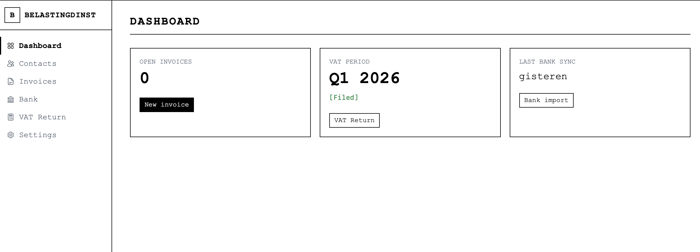
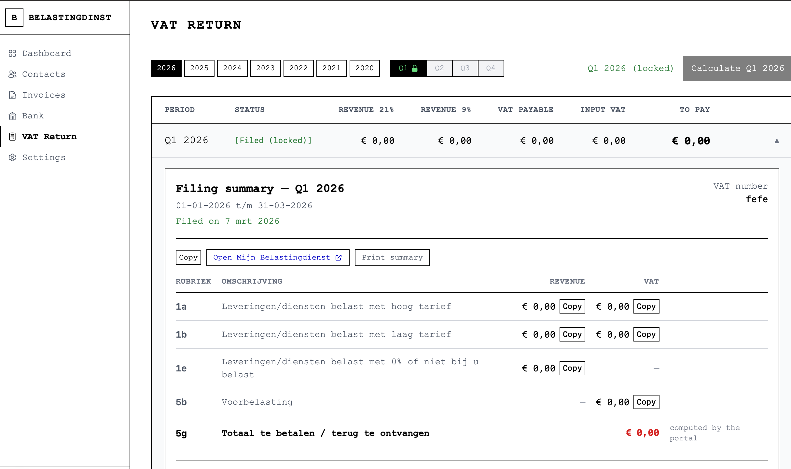
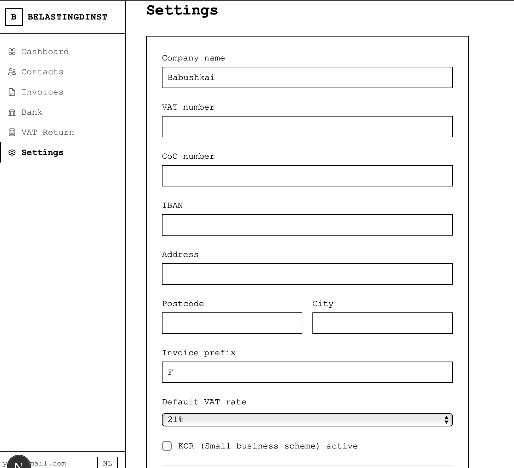

# Belastingdinst

Self-hosted Dutch accounting and VAT filing tool for ZZP'ers. Replaces Moneybird with a brutalist, no-nonsense interface.

## Screenshots

### Dashboard


### VAT Return


### Settings


## Features

- **Invoicing** — Create, send, and track invoices with gapless numbering
- **VAT Return (BTW)** — Quarterly calculation with rubrieken mapping, copy-to-clipboard, and portal deep link
- **Bank Import** — MT940, CAMT.053 (XML), and Wise CSV file import
- **Contacts** — Customer management with KvK/BTW number tracking
- **Multi-language** — Dutch and English interface

## Tech Stack

- Next.js 15 (App Router, RSC)
- Drizzle ORM + PostgreSQL
- Tailwind CSS
- Docker Compose

## Getting Started

```bash
# Start database
docker compose up -d postgres

# Install dependencies
pnpm install

# Run migrations
pnpm drizzle-kit push

# Create first user
pnpm tsx scripts/create-user.ts

# Start dev server
pnpm dev
```

## License

Private — All rights reserved.
